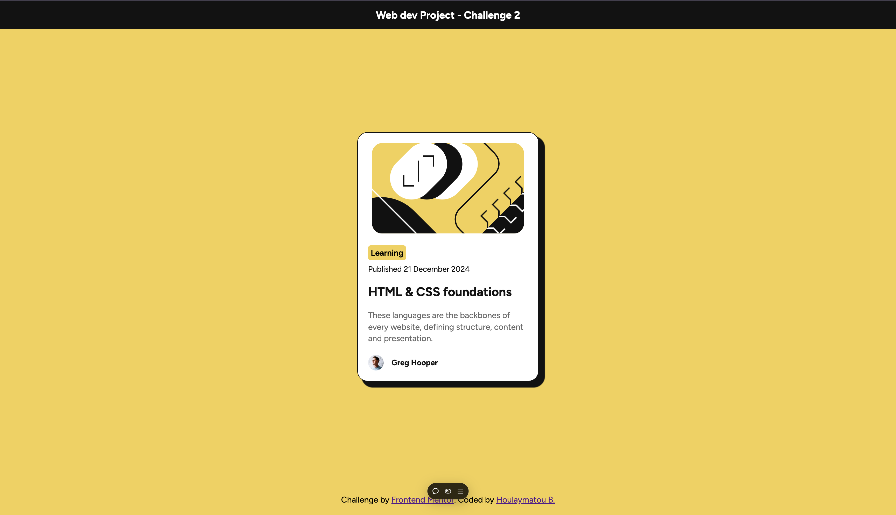

# Blog Preview Card 

This is my solution to the [Blog preview Component challenge on Frontend Mentor](https://www.frontendmentor.io/learning-paths/getting-started-on-frontend-mentor-XJhRWRREZd/steps/674e24aa92fdd6803cd0165e/challenge/start).

## Built With 🛠️

- Semantic HTML5
- CSS3 (Custom Properties, Flexbox)
- Modern CSS Practices (e.g., CSS Variables for reusable colors)

